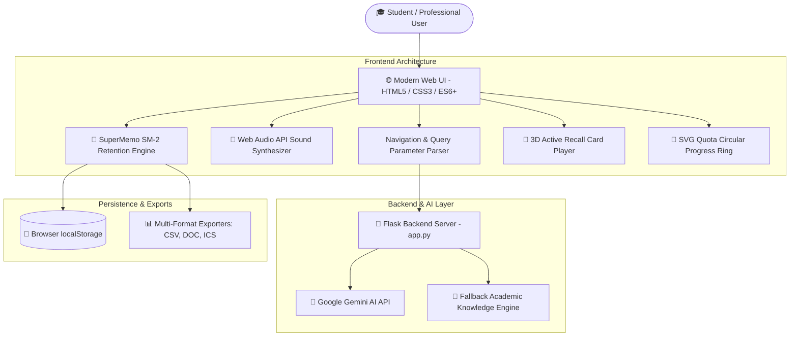
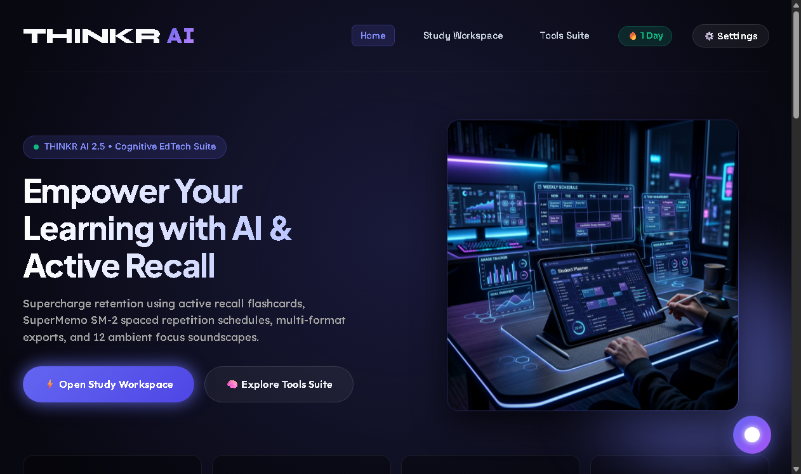
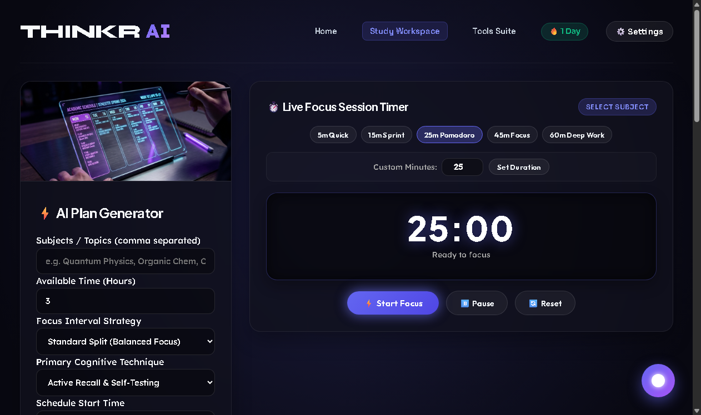
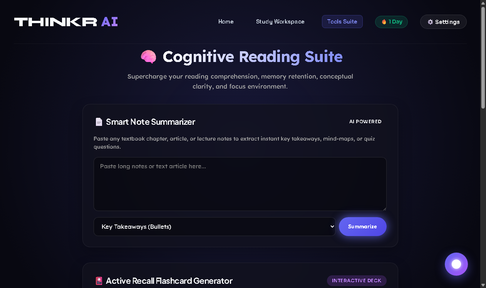
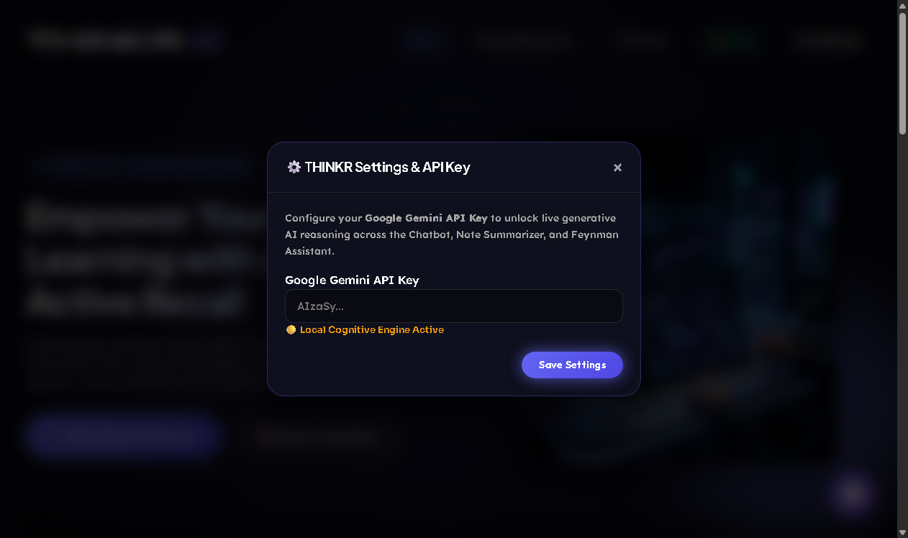

# 🧠 THINKR AI — The Future of Cognitive Intelligence & Accelerated Learning

[](https://www.python.org/)
[](https://flask.palletsprojects.com/)
[](LICENSE)
[](#-overview)

> **THINKR AI is the future of intelligence.** It is an elite, open-source cognitive learning platform designed to revolutionize how students, researchers, and professionals absorb, retain, and master complex knowledge. By integrating neuroscience-backed learning protocols—Active Recall, SuperMemo SM-2 Spaced Repetition, the Feynman Technique, and Procedural Web Audio Soundscapes—THINKR AI turns overwhelming syllabi into structured, effortless mastery pathways.

---

## 📑 Table of Contents

- [🧠 Overview](#-overview)
- [🌟 The Future of Intelligence & How to Use](#-the-future-of-intelligence--how-to-use)
- [🚀 Key Features](#-key-features)
- [🏗️ Project Architecture](#%EF%B8%8F-project-architecture)
- [📂 Folder Structure](#-folder-structure)
- [💻 Technology Stack](#-technology-stack)
- [⚙️ Configuration & Setup Guide](#%EF%B8%8F-configuration--setup-guide)
- [🔍 Comprehensive Code Breakdown](#-comprehensive-code-breakdown)
- [🤖 API Integration (Google Gemini AI Specs)](#-api-integration-google-gemini-ai-specs)
- [🛡️ Security & Credential Notes](#%EF%B8%8F-security--credential-notes)
- [🖼️ Application UI Gallery](#%EF%B8%8F-application-ui-gallery)
- [🔮 Future Enhancements](#-future-enhancements)
- [🤝 Contributions](#-contributions)
- [🙏 Thank You Note](#-thank-you-note)

---

## 🧠 Overview

Modern education often suffers from passive re-reading, cramming, and cognitive burnout. **THINKR AI** bridges the gap between raw information and deep mental encoding. It provides a full-suite digital study ecosystem equipped with live Pomodoro timers, interactive 3D flashcards, SuperMemo SM-2 memory retention decay algorithms, automatic note summarization, Feynman simplicity breakdowns, and 12 Web Audio focus soundscapes.

Whether preparing for computer science finals, medical board exams, or complex engineering certifications, THINKR AI acts as your personal AI cognitive copilot.

---

## 🌟 The Future of Intelligence & How to Use

### **Why THINKR AI Represents the Future of Learning:**
Traditional study tools are static text repositories. THINKR AI introduces **Active Learning Loops**:
1. **Input Stage:** Paste custom notes, syllabus targets, or code topics.
2. **Synthesis Stage:** Generate active recall flashcards, multi-format summaries, and Feynman breakdowns.
3. **Encoding Stage:** Execute Pomodoro focus blocks while listening to 10Hz Alpha or 40Hz Gamma binaural beats.
4. **Retention Stage:** SuperMemo SM-2 tracks your memory decay curve, auto-scheduling reviews right before you forget.

### **How to Use THINKR AI (Step-by-Step):**

1. **Build a Study Plan:**
   - Go to the **Study Workspace** (`/study-plan.html`).
   - Enter your target exam date, syllabus topics, and preferred focus strategy.
   - Click **`Build Cognitive Pathway`** to view your personalized daily roadmap.

2. **Track Memory & Spaced Repetition:**
   - Scroll to the **SuperMemo SM-2 Memory Engine** on the Study Workspace.
   - Add topics and rate your recall confidence ($1 - 5$). The engine calculates your next review milestone and plots your retention decay curve.
   - Export your review schedule to **Excel (`.csv`)**, **Word (`.doc`)**, or **iCal (`.ics`)**.

3. **Master Concepts with Tools Suite:**
   - Open the **Cognitive Tools Suite** (`/tools.html`).
   - Use the **Active Recall Flashcard Deck** (supports 2 to 15 cards with 3D flip effects and keyboard arrow navigation).
   - Use the **Smart Note Summarizer** for key takeaways, executive summaries, mind-maps, or quiz questions.
   - Activate **Web Audio Focus Soundscapes** (Rain, Alpha Waves, Gamma Focus, Deep Ocean, Forest, Cafe, etc.).

4. **Interact with THINKR Core AI Chatbot:**
   - Click the floating orb in the bottom-right corner to open **THINKR Core**.
   - Ask any question across Computer Science, Physics, Chemistry, Biology, Mathematics, History, Philosophy, Psychology, Code, or Time Complexities!

---

## 🚀 Key Features

| Feature | Description | Neuroscience / Technical Benefit |
| :--- | :--- | :--- |
| ⏱️ **Hero Focus Timer** | Preset intervals (5m, 15m, 25m, 45m, 60m) and custom minute picker | Prevents decision fatigue and maintains deep focus states. |
| 🎴 **3D Active Recall Deck** | Interactive 3D flip flashcards (2–15 cards) with keyboard controls | Forces active retrieval memory pathways. |
| 📅 **SuperMemo SM-2 Engine** | Algorithm tracking memory decay and calculating expanding review intervals | Locks information into long-term memory. |
| 📄 **Smart Summarizer** | Extracts Bullets, Executive Summaries, Mind-Maps, and Quizzes | Converts unstructured text into structured cognitive nodes. |
| 🧪 **Feynman Assistant** | Simplifies complex theoretical jargon into plain-English analogies | Tests true conceptual comprehension. |
| 🎵 **12 Focus Soundscapes** | Pure Web Audio API synthesizers (No external MP3 files needed) | Modulates brainwave entrainment (Alpha/Gamma beats). |
| 🎯 **Exam Pacing Calculator** | 3-Phase Academic Plan generator with interactive SVG progress ring | Breaks daunting syllabi into daily micro-goals. |
| 🤖 **Universal AI Assistant** | THINKR Core chatbot supporting Gemini API & local knowledge base | Instant academic search engine for definitions & code. |
| 🔥 **Daily Streak Engine** | Persistent `localStorage` tracking consecutive active study days | Gamifies daily study habits. |
| 📊 **Multi-Format Exporters** | 1-Click export to Excel (`.csv`), Word (`.doc`), iCal (`.ics`), and Print | Seamless workflow integration. |

---

## 🏗️ Project Architecture

THINKR AI follows a lightweight, modular Client-Server architecture powered by **Python Flask** on the backend and **Modern Native JavaScript / Glassmorphism Vanilla CSS** on the frontend.



---

## 📂 Folder Structure

```
THINKR_AI/
├── app.py                      # Flask Application Server (Port 3000)
├── static/
│   ├── script.js               # Core Client-Side Logic, AI Engine & Web Audio
│   └── style.css                # Glassmorphism Design System & 6-Font Typography
├── templates/
│   ├── index.html              # Homepage & Hero Quick Focus Workspace
│   ├── study-plan.html         # Study Workspace, SM-2 Engine & Roadmap Exporter
│   └── tools.html              # Cognitive Tools Suite (Flashcards, Audio, Summarizer)
├── images/
│   ├── homepage.png            # High-resolution screenshot of Homepage
│   ├── study_workspace.png     # High-resolution screenshot of Study Workspace
│   ├── tools_suite.png         # High-resolution screenshot of Tools Suite
│   └── settings_modal.png      # High-resolution screenshot of Settings Modal
├── scratch/                    # Build & Utility Scripts
├── README.md                   # Complete Documentation & Architecture Specs
└── requirements.txt            # Python Dependencies
```

---

## 💻 Technology Stack

### **Frontend & UI Design:**
- **Core:** HTML5, Modern ES6 JavaScript.
- **Styling:** Vanilla CSS3 Glassmorphism System (Dynamic HSL gradients, backdrop filters, translucent cards).
- **Typography:** Multi-font Google System (`Plus Jakarta Sans`, `Space Grotesk`, `Outfit`, `Lexend`, `Sora`, `Syne`).
- **Audio:** Web Audio API (Pure procedural sound synthesis for Rain, Noise, Oscillators & LFO swells).

### **Backend & Core Engine:**
- **Framework:** Python Flask (v3.0+).
- **AI Integration:** Google Gemini API (`gemini-1.5-flash`, `gemini-1.5-pro`) & Local Fallback Engine.
- **State Management:** Persistent Client-Side `localStorage`.

---

## ⚙️ Configuration & Setup Guide

### **1. Prerequisites:**
- Python 3.9 or higher installed.
- Git installed.

### **2. Clone the Repository:**
```bash
git clone https://github.com/SriniwasAwasthi/THINKR_AI.git
cd THINKR_AI
```

### **3. Install Dependencies:**
```bash
pip install -r requirements.txt
```
*(If `requirements.txt` is not present, install Flask: `pip install flask`)*

### **4. Launch Local Dev Server:**
```bash
python app.py
```
The server will start on `http://localhost:3000`. Open your browser to explore!

---

## 🔍 Comprehensive Code Breakdown

### **1. Web Audio Soundscape Synthesizer (`static/script.js`)**
THINKR AI generates audio procedurally without external MP3 files:
```javascript
// Example: 10Hz Alpha Waves Binaural Beat Synthesizer
playBinaural: async function() {
    await this.initCtx();
    this.stopAll();
    const oscLeft = this.ctx.createOscillator();
    const oscRight = this.ctx.createOscillator();
    oscLeft.frequency.value = 200;  // Left Ear Frequency
    oscRight.frequency.value = 210; // Right Ear Frequency (10Hz Alpha Beat)
    
    const merger = this.ctx.createChannelMerger(2);
    oscLeft.connect(merger, 0, 0);
    oscRight.connect(merger, 0, 1);
    merger.connect(this.ctx.destination);
    oscLeft.start();
    oscRight.start();
}
```

### **2. SuperMemo SM-2 Spaced Repetition Engine (`templates/study-plan.html`)**
Calculates optimal review intervals based on user recall confidence ratings:
```javascript
// SM-2 Interval Calculation
let interval = 1;
if (level === 1) interval = 1;      // Repeat Tomorrow
else if (level === 2) interval = 3; // Hard
else if (level === 3) interval = 7; // Good
else if (level === 4) interval = 14;// Easy
else if (level === 5) interval = 30;// Mastered
```

---

## 🤖 API Integration (Google Gemini AI Specs)

THINKR AI supports seamless integration with **Google Gemini API**:
- **Supported Models:** `gemini-1.5-flash`, `gemini-1.5-pro`, `gemini-2.0-flash-exp`.
- **Setup:** Click **`⚙️ Settings`** in the navigation bar and paste your Gemini API key (`AIzaSy...`).
- **Privacy Guarantee:** Your API key is stored strictly in your browser's private `localStorage` (`thinkr_gemini_api_key`) and is **never** sent to any external backend server.

---

## 🛡️ Security & Credential Notes

- **Zero Server Storage of API Keys:** API keys remain strictly client-side.
- **No External Audio Assets:** Audio is synthesized in-memory via the Web Audio API, eliminating tracking or external request risks.
- **Local State Independence:** All flashcards, thoughts, spaced repetition schedules, and streak metrics reside safely in browser `localStorage`.

---

## 🖼️ Application UI Gallery

### **1. Homepage & Quick Focus Workspace**


### **2. Study Workspace & SuperMemo SM-2 Memory Engine**


### **3. Cognitive Tools Suite (Flashcards, Audio & Summarizer)**


### **4. Settings & Gemini API Modal**


---

## 🔮 Future Enhancements

- 📱 **Progressive Web App (PWA):** Offline service worker installation support.
- 🎙️ **Voice-to-Text Feynman Evaluator:** Real-time speech simplicity grading.
- 📁 **Anki & Quizlet Deck Importer:** Drag-and-drop `.csv`/`.tsv` flashcard file parser.
- 📊 **Advanced Analytics Dashboard:** Visual heatmaps of weekly study hours.

---

## 🤝 Contributions

Contributions are always welcome! Feel free to open issues or submit pull requests to enhance THINKR AI.

1. Fork the Project.
2. Create your Feature Branch (`git checkout -b feature/AmazingFeature`).
3. Commit your Changes (`git commit -m 'Add some AmazingFeature'`).
4. Push to the Branch (`git checkout -b feature/AmazingFeature`).
5. Open a Pull Request.

---

## 🙏 Thank You Note

> **Thank you for using and supporting THINKR AI!**  
> Built with passion, dedication, and a commitment to transforming global education. Special thanks to all students, educators, and developers pushing the boundaries of cognitive technology. Keep learning, keep building, and unlock your true cognitive potential with THINKR AI! 🚀
